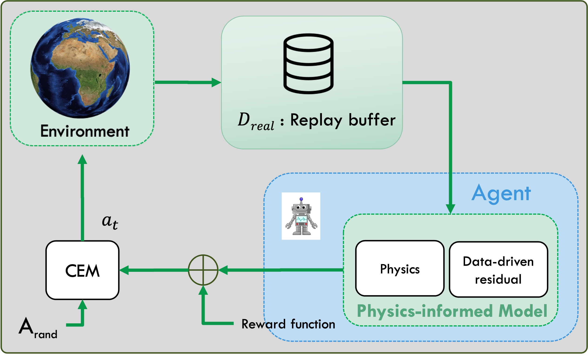
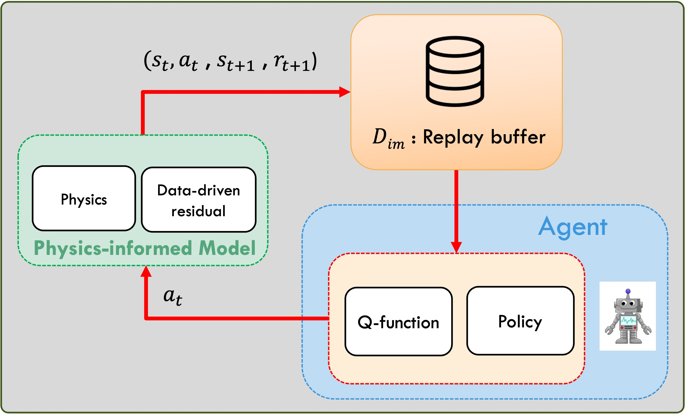
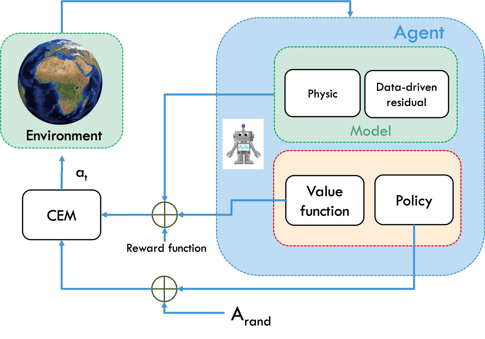

# PHIHP: Physics-Informed Model and Hybrid Planning for Efficient Dyna-Style Reinforcement Learning

## Installation

To run this project, you need to have the following prerequisites installed on your machine:
```
pip install -r requirements.txt
```

## Training a Physics-Informed Model

<p align="center">
  
</p>

Train first, a physics-informed model:

```
python scripts/train_all_models.py
```


##  Training a model-free Actor-Critic agent (TD3) through imagination

<p align="center">
  
</p>

Then, train a model-free agent on the "fake_env" that generate imaginary trajectories with learned model:

```
python scripts/train_all_policies.py
```


##  Evaluating PhIHP

<p align="center">
  
</p>

Finally, evaluate PhIHP on the real environment:
```
python scripts/eval_all_phihp.py
```

##  Display Agents

<p align="center">
  
</p>

to display the trained agent:
```
python scripts/display_all_phihp.py
```
